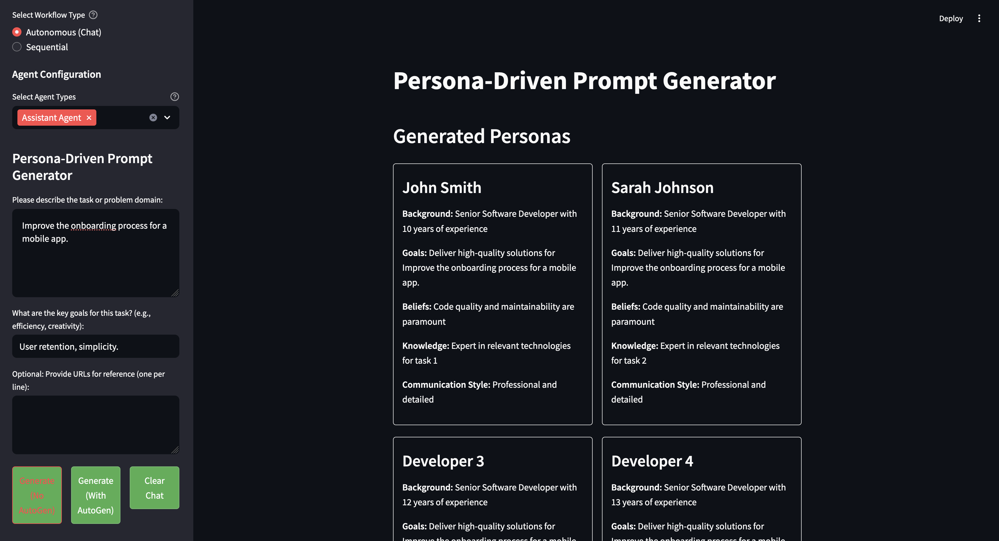
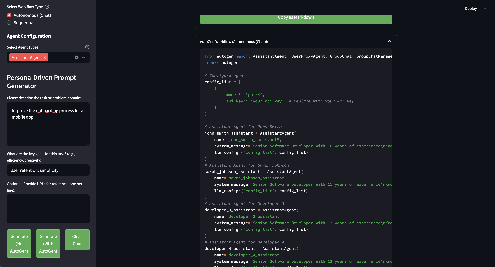

# Custom Prompt Generator

## Overview
The Custom Prompt Generator is a Python application that leverages Large Language Models (LLMs) and the LiteLLM library to dynamically generate personas, fetch knowledge sources, resolve conflicts, and produce tailored prompts. This application is designed to assist in various software development tasks by providing context-aware prompts based on user input and predefined personas.




## Features
- **Dynamic Persona Generation**: Create realistic personas with human-like names, backgrounds, and expertise.
- **Flexible Persona Count**: Generate 1-10 personas based on your needs.
- **Knowledge Source Fetching**: Fetch relevant knowledge sources using the LiteLLM library.
- **Conflict Resolution**: Resolve conflicts among personas to ensure coherent and fair task execution.
- **Prompt Generation**: Generate tailored prompts based on personas, knowledge sources, and conflict resolutions.
- **AutoGen Integration**:
  - Choose between Autonomous (Chat) and Sequential workflows
  - Configure different agent types (User Proxy, Assistant, GroupChat)
  - Generate executable Python code for AutoGen workflows
- **Export Options**: 
  - Export prompts in Markdown format
  - Copy generated content directly from the UI
  - Download AutoGen workflow as Python file

## Configuration

This application uses [LiteLLM](https://github.com/BerriAI/litellm) to support multiple LLM providers. You can choose from:

1. **OpenAI** (GPT-3.5, GPT-4)
   - Best for general purpose, high-quality responses
   - Requires OpenAI API key

2. **Groq** (Mixtral, Llama)
   - Best for fast inference, competitive pricing
   - Requires Groq API key

3. **DeepSeek**
   - Best for specialized tasks, research applications
   - Requires DeepSeek API key

4. **Hugging Face**
   - Best for custom models, open-source alternatives
   - Requires Hugging Face API key

5. **Ollama** (Local Deployment)
   - Best for self-hosted, privacy-focused applications
   - Can run locally without API key

### Quick Start
1. Copy the environment template:
   ```bash
   cp env-example .env
   ```

2. Edit `.env` and configure your chosen provider:
   ```bash
   # Example for OpenAI
   LITELLM_MODEL=gpt-3.5-turbo
   LITELLM_PROVIDER=openai
   OPENAI_API_KEY=your-openai-api-key
   ```

3. Run with the quickstart script:
   ```bash
   chmod +x quickstart.sh
   ./quickstart.sh
   ```

## Database Setup

This application uses PostgreSQL with the pgvector extension for efficient vector storage and similarity search. The database is used to store:
- Generated personas
- Task history
- Vector embeddings
- Emotional tones data

### Automatic Database Setup
1. Run the database setup script:
   ```bash
   chmod +x setup_database.sh
   sudo ./setup_database.sh
   ```
   This script will:
   - Install PostgreSQL 17
   - Install pgvector extension
   - Create database and user
   - Configure authentication
   - Set up required tables
   - Run connection tests

2. Default database configuration:
   - Database Name: persona_db
   - User: persona_user
   - Port: 5432
   
   You can modify these in setup_database.sh before running.

### Manual Database Setup
If you prefer manual setup:

1. Install PostgreSQL 17:
   ```bash
   # Ubuntu
   sudo apt install postgresql-17
   
   # RHEL/Amazon Linux
   sudo dnf install postgresql17-server
   ```

2. Install pgvector:
   ```bash
   # Ubuntu
   sudo apt install postgresql-17-pgvector
   
   # RHEL/Amazon Linux
   sudo yum install pgvector_17
   ```

3. Configure database:
   ```bash
   sudo -u postgres psql
   CREATE DATABASE persona_db;
   CREATE USER persona_user WITH PASSWORD 'your_password';
   GRANT ALL PRIVILEGES ON DATABASE persona_db TO persona_user;
   \c persona_db
   CREATE EXTENSION vector;
   ```

### Database Schema
The application uses several tables:
- `task_memory`: Stores task history and vector embeddings
- `emotional_tones`: Stores predefined emotional tones for personas
- `personas`: Stores generated persona information

### Troubleshooting Database Issues
- **Connection Issues**: Check PostgreSQL service status
  ```bash
  sudo systemctl status postgresql-17
  ```
- **Permission Errors**: Verify user privileges
  ```bash
  sudo -u postgres psql -c "\du"
  ```
- **pgvector Issues**: Confirm extension installation
  ```bash
  sudo -u postgres psql -d persona_db -c "\dx"
  ```

## Development Setup
1. Create a Python virtual environment:
   ```bash
   python -m venv venv
   source venv/bin/activate  # Linux/Mac
   # or
   .\venv\Scripts\activate  # Windows
   ```

2. Install dependencies:
   ```bash
   pip install -r requirements.txt
   ```

## Usage
1. Open the application in your browser
2. In the sidebar:
   - Enter the task description and goals
   - Select the number of personas (1-10)
   - Configure AutoGen settings (if using AutoGen)
3. Choose your generation method:
   - "Generate (No AutoGen)" for standard prompts
   - "Generate (With AutoGen)" for AutoGen workflows
4. View and interact with:
   - Generated personas with realistic details
   - Knowledge sources and conflict resolutions
   - Markdown-formatted output
   - AutoGen workflow code
5. Export or copy your generated content as needed

## AutoGen Workflow Types
1. **Autonomous (Chat)**
   - Creates a chat-based interaction between agents
   - Suitable for collaborative problem-solving
   - Includes initiator and receiver agents

2. **Sequential**
   - Creates a step-by-step workflow
   - Agents execute in a predefined order
   - Better for structured tasks

## Agent Types
- **User Proxy Agent**: Represents the user and executes code
- **Assistant Agent**: Plans and generates code to solve tasks
- **GroupChat**: Manages interactions between multiple agents

## File Structure
- `main.py`: Main application with UI and core logic
- `llm_interaction.py`: LLM integration and AutoGen workflow generation
- `persona_management.py`: Persona generation and management
- `database.py`: Database interactions
- `search.py`: Knowledge source fetching
- `utils.py`: Utility functions

## Contributing
Contributions are welcome! Please read our contributing guidelines and submit pull requests for any enhancements.

## License
This project is licensed under the MIT License - see the LICENSE file for details.
